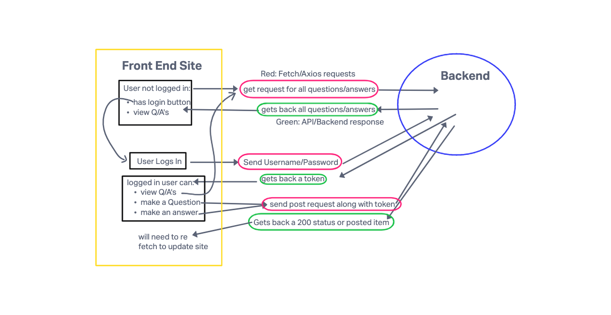

# Basic Forum App

## Team Members:

* Kirill Lesnykh
* Jonathan Tsai
* Laurel Perkins
* Mohammed Abubakar

# Project: Basic Forum App

This application is meant to allow users to both ask questions and reply to questions with answers. Users should not be able to edit other peoples questions/answers, but should be allowed to answer other's questions or ask their own questions.

## Installation

1. Clone the repository: ``
2. Navigate to the project directory: ``
3. Install dependencies: `npm install`

## Usage

To start the app, navigate to the app [website](netlifylinktowebsite.com)

## Contributing

Contributions to our Forum app are welcome! If you find a bug or would like to suggest an improvement, please open an issue or submit a pull request.

## License

This Forum app is licensed under the [MIT License](https://opensource.org/licenses/MIT).

## Cooperation Plan

**What are the key strengths of each person on the team? How do we plan on using these strengths?**  
Kirk: Good with functionality/backend focused. Not too creative, doesn't like front end much  
Laurel: Loves front end, very creative  
Jonathan: jack of all trades, master of non, can help anywhere that's needed  
Mo: Extremely good looking  

## Our plan for Day to Day work

- use github projects for task managing
- standup every morning to assess which parts of our project are nearing completion and what parts need more attention/help
- we all agree to put in 100% effort into this project and ask for help if we need it. If anyone is falling behind it doesn't mean they aren't putting in effort, it means they need help
- we will be working in person

## Conflict Plan

- be human to each other, respect each other and each others opinions, and worst case scenario make a vote where 2/3 people wins
- no one will be taking over the project, this is sworn by each of us in blood
- if someone needs help or needs explanation then do it and do it with respect
- we all agree to put in 100% effort, so no one will be contributing less
- if resolution attempts are unsuccessful then we will ask a third party like the teacher or maybe TA to step in

## Communication Plan

- All hours available for communication over slack, but don't expect a reply after 6pm
- We will take breaks as needed, every hour or so and maybe lunch
- if you start to fall behind, then ask for help
- after hours and on the weekend you can send messages, but don't expect responses. If team members are available they will respond
- Everyones voice will be heard. We will each respect and treat each other how we want to be treated
- We have already addressed the issue of a safe environment where everyone will be heard. We will each respect each other and treat each other like humans

## Work Plan

- we wil be using github projects to make and assign tasks and only work on them during working hours unless agreed upon otherwise

## Git Process

- front and back end's for this application will live on github
- everyone will clone the repo they are working on to their local computer and
- work off of a separate branch for each task, then
- make a push into the dev branch for review from other team members
- one person will need to review before merging
- merge to dev branch every morning, and once project is MVP, merge dev into main
- if we have more time, then keep working on dev branch while the main is the MVP, if new changes look good to everyone, then merge to main

## User Stories

- as a non-logged in user, I want the capability to read questions
- as a non-logged in user, I want the capability to read answers
- as a logged-in user, I want to be able to ask a question
- as a logged-in user, I want to be able to answer a question

## Front-End UML/Data Flow

## Domain Model

Yellow routes need a user to be logged in  

